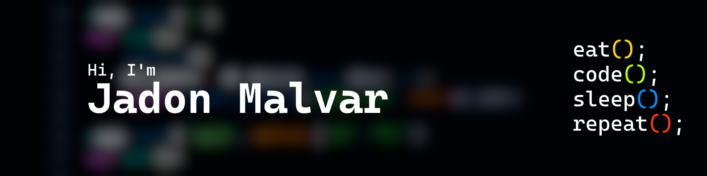

## About Myself
I'm Jadon, an aspiring software engineer with interests in app development and machine learning.  

My journey began at an early age by learning Lua to create video games using Roblox Studio. I have branched out since then to full-stack apps and machine learning models. I also like building software tools that have a helpful impact on people.

I can work full-stack, but I prefer working on the backend. Whenever I do work on the frontend or UI, I like creating minimalistic designs inspired by Apple. 

## Skill Stack

**Also comfortable with:** Repl.it
